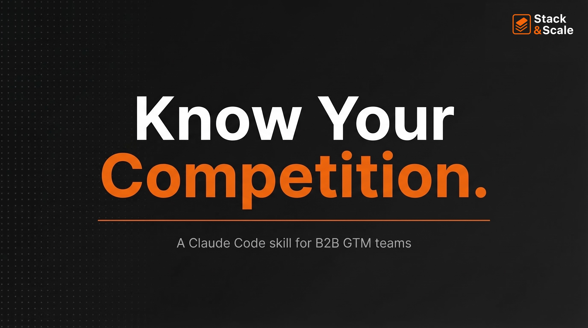

# `/competitive-intelligence` — Claude Code Skill

A Claude Code skill that builds a **comprehensive, research-backed competitive intelligence document** for any B2B SaaS client — written directly to a Markdown file and ready for use in sales, positioning, and GTM strategy work.

---

## What It Does

Run `/competitive-intelligence` and Claude will:

1. Read your client's existing context files (ICP, positioning, messaging)
2. Identify and tier competitors via G2, Capterra, LinkedIn, Crunchbase, and web research
3. Deep-research each competitor across pricing, GTM motion, strengths, weaknesses, and recent moves
4. Synthesize findings using April Dunford's differentiation framework
5. Write a complete `competitive.md` to your client folder

The output is a **strategic asset**, not a feature spreadsheet — built for sales enablement, positioning work, and GTM advisory.

---

## Output: 10-Section `competitive.md`

| Section | What It Contains |
|---------|-----------------|
| 1. Market Landscape | Category definition, market dynamics, competitive tiers |
| 2. Competitor Index | Quick-reference table: ICP, ACV, GTM motion, funding, headcount |
| 3. Feature / Capability Matrix | ✓ Strong · ~ Partial · ✗ Missing across all competitors |
| 4. Per-Competitor Deep Dives | Positioning, ICP, pricing, GTM, strengths, weaknesses, recent moves |
| 5. Pricing & Packaging Analysis | Pricing landscape + strategic recommendation |
| 6. Win / Loss Themes | Why you win, why you lose, objection response table |
| 7. Differentiation Map | True differentiators vs. table stakes vs. gaps (honest) |
| 8. Positioning Opportunities | Whitespace the client can credibly own |
| 9. Battle Cards | One per Tier 1 competitor — 30-second sales rep ready |
| 10. Intel Refresh Log | Cadence, signals to watch, refresh history |

---

## Inputs

**Required:**
- Client name (maps to `~/Obsidian/01-Clients/[ClientName]/`)
- Client website URL
- Client LinkedIn company page URL

**Optional (improves output quality):**
- Known competitor list
- Win/loss context, Gong call themes, sales objections
- Competitors to deprioritize or focus on

**Auto-read from client folder (if they exist):**
- `context.md` · `positioning.md` · `icp.md` · `messaging.md`

---

## Usage

```
/competitive-intelligence

Run competitive intelligence for Avarra (https://avarra.ai).
Competitors: SecondNature, Hyperbound, FullyRamped.
```

```
/competitive-intelligence

Do competitive intel for Clay (https://clay.com/). Figure out who's
in their space and build the full analysis.
```

If you don't provide a competitor list, the skill will research and propose a tiered list for your confirmation before running the full analysis.

---

## Competitor Tiers

| Tier | Definition |
|------|-----------|
| **Tier 1 — Direct** | Same ICP, same problem, same GTM motion. Head-to-head in deals. |
| **Tier 2 — Adjacent** | Overlapping capability or ICP, but not always in the same deal. |
| **Tier 3 — Indirect** | "Do nothing" / status quo / DIY approaches. Always included. |

> "Do nothing" is always represented as a Tier 3 competitor — because 40% of B2B deals are lost to no decision, not named competitors.

---

## Tips & Tricks

**Seed it with Gong or loss data.**
Paste win/loss themes, call notes, or objections as context. The skill weaves them into Section 6 (Win/Loss Themes) as verified intel rather than `[ESTIMATED]`.

**Let it discover competitors.**
Even if you know your main competitors, the discovery pass often surfaces Tier 2/3 threats you're not actively tracking. Worth the extra 2 minutes.

**Run it before positioning work.**
The Differentiation Map (Section 7) directly informs messaging, ICP prioritization, and homepage copy. Don't position in a vacuum.

**It's honest, not cheerleading.**
The skill surfaces where the client is weaker than competitors. That's intentional — strategic blind spots are expensive.

**Battle cards are sales-ready.**
Section 9 is written for a rep who needs to respond in 30 seconds. "Here's what they'll say, here's what you say back, here's the landmine to plant early."

**Use the Intel Refresh Log.**
Competitive intel goes stale fast. Section 10 defines a watch list and cadence — follow it.

---

## File Structure

```
competitive-intelligence/
├── SKILL.md                          ← Full skill instructions for Claude
├── README.md                         ← This file
├── references/
│   └── competitive-template.md       ← 10-section output template
└── evals/
    └── evals.json                    ← Test cases for skill validation
```

---

## Installation

1. Clone or download this repo into your Claude skills directory:
   ```bash
   git clone https://github.com/[your-username]/competitive-intelligence \
     ~/.claude/claudecodeskills/competitive-intelligence
   ```

2. Register the skill by creating `~/.claude/commands/competitive-intelligence.md`:
   ```bash
   cat > ~/.claude/commands/competitive-intelligence.md << 'EOF'
   ---
   allowed-tools: Read, Write, Edit, WebSearch, WebFetch, AskUserQuestion, Glob, Grep, Bash
   description: Build a comprehensive competitive analysis and intelligence document for a B2B SaaS client. Use this skill when the user wants to research competitors, create a competitive landscape overview, build battle cards, analyze competitor positioning and pricing, identify differentiation opportunities, or populate a client's competitive.md file.
   ---

   $ARGUMENTS

   See ~/.claude/claudecodeskills/competitive-intelligence/SKILL.md for full instructions on how to execute this skill.
   EOF
   ```

3. The `/competitive-intelligence` command is now available in Claude Code.

---

## Designed For

- **Fractional CMOs** running client competitive assessments
- **GTM advisors** who need sales-ready battle cards fast
- **Marketing leaders** building positioning from competitive whitespace
- **Founders** who want an honest read on their market before messaging work

---

## Related Skills

If you're building a full GTM stack with Claude Code skills, this pairs well with:
- `/icp-builder` — Define tiered ICP from firmographic + trigger + behavioral signals
- `/positioning` — April Dunford 5-step positioning methodology
- `/copywriting` — Homepage and landing page copy grounded in differentiation

---

*Built for Claude Code · Requires an active Claude session*

---

*Built by [Stack & Scale](https://stackandscale.ai/) — the newsletter on AI workflows for GTM teams.*
